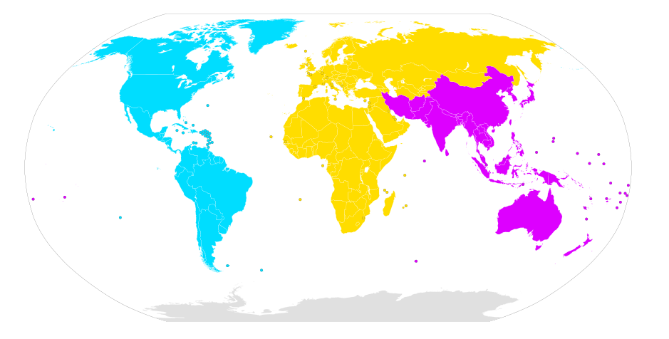

# Introduction

Getting started in amateur radio is the beginning of a life-long journey.

# Specifics

To find your country specific information, pick one of the three coloured
ITU regions to find your country in the list.

The regions can be found here:
*  [Region 1](./Region%201/)
  - Europe, Africa, the Commonwealth of Independent States, Mongolia, and the Middle East west of the Persian Gulf, including Iraq.
*  [Region 2](./Region%202/)
  - the Americas including Greenland, and some of the eastern Pacific Islands.
*  [Region 3](./Region%203/)
  - most of non-FSU Asia east of and including Iran, and most of Oceania.

# Credits
* ITU map
  - https://commons.wikimedia.org/wiki/File:International_Telecommunication_Union_regions_with_dividing_lines.svg
* Coloured Squares
  - https://tinysquare.page/
